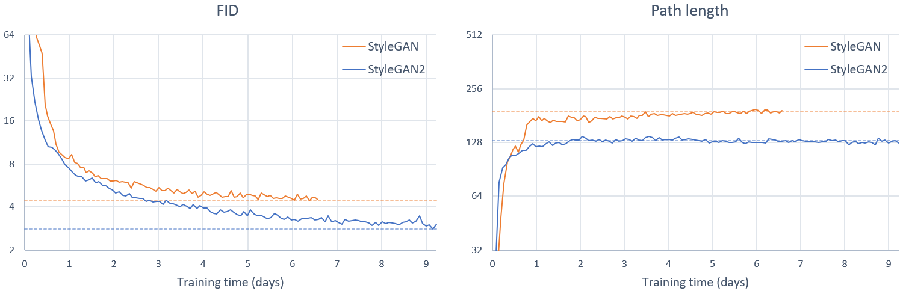

## StyleGAN2 Tensorflow


Аннотация: *Архитектура GAN на основе стилей (StyleGAN) дает самые современные результаты в безусловном генеративном моделировании изображений. Мы раскрываем и анализируем некоторые из её характерных артефактов и предлагаем изменения как в архитектуре модели, так и в методах обучения для их устранения. В частности, мы модернизируем нормализацию генератора, пересматриваем прогрессивный рост и упорядочиваем генератор, чтобы обеспечить хорошее согласование при отображении скрытых векторов в изображения. Помимо улучшения качества изображения, этот регуляризатор длины пути дает дополнительное преимущество, заключающееся в том, что генератор становится значительно легче инвертировать. Это позволяет надежно определить, создается ли изображение конкретной сетью. Кроме того, мы визуализируем, насколько хорошо генератор использует свое выходное разрешение, и определяем проблему с производительностью, что мотивирует нас обучать более крупные модели для дополнительного улучшения качества. В целом, наша улучшенная модель переопределяет современный уровень безусловного моделирования изображений, как с точки зрения существующих показателей качества распространения, так и с точки зрения воспринимаемого качества изображения.*

## Требования

* Операционные системы: Linux или Windows.
* 64-bit Python 3.6.
* TensorFlow 1.14.
* NVIDIA GPU, NVIDIA драйвера, CUDA 10.0 и cuDNN 7.5.

## Использование предварительно обученных сетей

Предварительно обученные сети хранятся в виде файлов `* .pkl` на [StyleGAN2 Google Drive](https://drive.google.com/open?id=1QHc-yF5C3DChRwSdZKcx1w6K8JvSxQi7). Ниже вы можете ссылаться на них напрямую, используя синтаксис `gdrive: networks / <filename> .pkl`, или загружать их вручную и ссылаться по имени файла.

```.bash
python run_generator.py generate-images --network=gdrive:networks/stylegan2-ffhq-config-f.pkl \
  --seeds=6600-6625 --truncation-psi=0.5

python run_generator.py generate-images --network=gdrive:networks/stylegan2-ffhq-config-f.pkl \
  --seeds=66,230,389,1518 --truncation-psi=1.0

python run_generator.py generate-images --network=gdrive:networks/stylegan2-car-config-f.pkl \
  --seeds=6000-6025 --truncation-psi=0.5

python run_generator.py style-mixing-example --network=gdrive:networks/stylegan2-ffhq-config-f.pkl \
  --row-seeds=85,100,75,458,1500 --col-seeds=55,821,1789,293 --truncation-psi=1.0
```

Результаты помещаются в `results/<RUNNING_ID>/*.png`. Вы можете изменить местоположение с помощью `--result-dir`. Например, `--result-dir=~/my-stylegan2-results`.

## Подготовка датасетов

Наборы данных хранятся как TFRecords с несколькими разрешениями, аналогично [исходному StyleGAN](https://github.com/NVlabs/stylegan). Каждый набор данных состоит из нескольких файлов `*.tfrecords`, хранящихся в общем каталоге, например,` ~/datasets/ffhq/ffhq-r-*.tfrecords`. В следующих разделах наборы данных указываются с использованием комбинации аргументов `--dataset` и` --data-dir`, например, `--dataset=ffhq --data-dir=~/datasets`.

**FFHQ**. Чтобы загрузить [Flickr-Faces-HQ](https://github.com/NVlabs/ffhq-dataset) набор данных как TFRecords с несколькими разрешениями, запустите:

```.bash
pushd ~
git clone https://github.com/NVlabs/ffhq-dataset.git
cd ffhq-dataset
python download_ffhq.py --tfrecords
popd
python dataset_tool.py display ~/ffhq-dataset/tfrecords/ffhq
```

**LSUN**. Загрузите нужные категории LSUN в формате LMDB со [страницы проекта LSUN] (https://www.yf.io/p/lsun). Чтобы преобразовать данные в TFRecords с несколькими разрешениями, запустите:

```.bash
python dataset_tool.py create_lsun_wide ~/datasets/car ~/lsun/car_lmdb --width=512 --height=384
python dataset_tool.py create_lsun ~/datasets/cat ~/lsun/cat_lmdb --resolution=256
python dataset_tool.py create_lsun ~/datasets/church ~/lsun/church_outdoor_train_lmdb --resolution=256
python dataset_tool.py create_lsun ~/datasets/horse ~/lsun/horse_lmdb --resolution=256
```

**Custom**. Создавайте собственные наборы данных, помещая все обучающие изображения в один каталог. Изображения должны иметь форму квадрата и иметь одинаковые разрешения. Чтобы преобразовать изображения в TFRecords с несколькими разрешениями, запустите:

```.bash
python dataset_tool.py create_from_images ~/datasets/my-custom-dataset ~/my-custom-images
python dataset_tool.py display ~/datasets/my-custom-dataset
```

## Обучение сети

Чтобы воспроизвести обучающие прогоны для конфигурации F в таблицах 1 и 3, запустите:

```.bash
python run_training.py --num-gpus=8 --data-dir=~/datasets --config=config-f \
  --dataset=ffhq --mirror-augment=true
python run_training.py --num-gpus=8 --data-dir=~/datasets --config=config-f \
  --dataset=car --total-kimg=57000
python run_training.py --num-gpus=8 --data-dir=~/datasets --config=config-f \
  --dataset=cat --total-kimg=88000
python run_training.py --num-gpus=8 --data-dir=~/datasets --config=config-f \
  --dataset=church --total-kimg 88000 --gamma=100
python run_training.py --num-gpus=8 --data-dir=~/datasets --config=config-f \
  --dataset=horse --total-kimg 100000 --gamma=100
```

Для других конфигураций см. `python run_training.py --help`.

| Конфигурация  | Разрешение      | Тысяч img  | 1 GPU   | 2 GPUs  | 4 GPUs  | 8 GPUs | GPU mem |
| :------------ | :-------------: | :--------: | :-----: | :-----: | :-----: | :----: | :-----: |
| `config-f`    | 1024&times;1024 | 25000      | 69d 23h | 36d 4h  | 18d 14h | 9d 18h | 13.3 GB |
| `config-f`    | 1024&times;1024 | 10000      | 27d 23h | 14d 11h | 7d 10h  | 3d 22h | 13.3 GB |
| `config-e`    | 1024&times;1024 | 25000      | 35d 11h | 18d 15h | 9d 15h  | 5d 6h  | 8.6 GB  |
| `config-e`    | 1024&times;1024 | 10000      | 14d 4h  | 7d 11h  | 3d 20h  | 2d 3h  | 8.6 GB  |
| `config-f`    | 256&times;256   | 25000      | 32d 13h | 16d 23h | 8d 21h  | 4d 18h | 6.4 GB  |
| `config-f`    | 256&times;256   | 10000      | 13d 0h  | 6d 19h  | 3d 13h  | 1d 22h | 6.4 GB  |

Кривые обучения для FFHQ config F (StyleGAN2) по сравнению с исходным StyleGAN с использованием 8 графических процессоров:



## Оценочные показатели

Чтобы воспроизвести числа для config F в таблицах 1 и 3, запустите:

```.bash
python run_metrics.py --data-dir=~/datasets --network=gdrive:networks/stylegan2-ffhq-config-f.pkl \
  --metrics=fid50k,ppl_wend --dataset=ffhq --mirror-augment=true
python run_metrics.py --data-dir=~/datasets --network=gdrive:networks/stylegan2-car-config-f.pkl \
  --metrics=fid50k,ppl2_wend --dataset=car
python run_metrics.py --data-dir=~/datasets --network=gdrive:networks/stylegan2-cat-config-f.pkl \
  --metrics=fid50k,ppl2_wend --dataset=cat
python run_metrics.py --data-dir=~/datasets --network=gdrive:networks/stylegan2-church-config-f.pkl \
  --metrics=fid50k,ppl2_wend --dataset=church
python run_metrics.py --data-dir=~/datasets --network=gdrive:networks/stylegan2-horse-config-f.pkl \
  --metrics=fid50k,ppl2_wend --dataset=horse
```

Обратите внимание, что метрики оцениваются каждый раз с использованием разных случайных начальных значений, поэтому результаты будут различаться между запусками. В следующей таблице перечислены доступные метрики с ожидаемым временем выполнения и случайными вариациями:

| Метрика     | FFHQ config F  | 1 GPU  | 2 GPUs  | 4 GPUs | Описание    |
| :---------- | :------------: | :----: | :-----: | :----: | :---------- |
| `fid50k`    | 2.84 &pm; 0.03 | 22 min | 14 min  | 10 min | [Fr&eacute;chet Inception Distance](https://arxiv.org/abs/1706.08500)
| `is50k`     | 5.13 &pm; 0.02 | 23 min | 14 min  | 8 min  | [Inception Score](https://arxiv.org/abs/1606.03498)
| `ppl_zfull` | 348.0 &pm; 3.8 | 41 min | 22 min  | 14 min | [Perceptual Path Length](https://arxiv.org/abs/1812.04948) in Z, full paths
| `ppl_wfull` | 126.9 &pm; 0.2 | 42 min | 22 min  | 13 min | [Perceptual Path Length](https://arxiv.org/abs/1812.04948) in W, full paths
| `ppl_zend`  | 348.6 &pm; 3.0 | 41 min | 22 min  | 14 min | [Perceptual Path Length](https://arxiv.org/abs/1812.04948) in Z, path endpoints
| `ppl_wend`  | 129.4 &pm; 0.8 | 40 min | 23 min  | 13 min | [Perceptual Path Length](https://arxiv.org/abs/1812.04948) in W, path endpoints
| `ppl2_wend` | 145.0 &pm; 0.5 | 41 min | 23 min  | 14 min | [Perceptual Path Length](https://arxiv.org/abs/1812.04948) without center crop
| `ls`        | 154.2 / 4.27   | 10 hrs | 6 hrs   | 4 hrs  | [Linear Separability](https://arxiv.org/abs/1812.04948)
| `pr50k3`    | 0.689 / 0.492  | 26 min | 17 min  | 12 min | [Precision and Recall](https://arxiv.org/abs/1904.06991)

